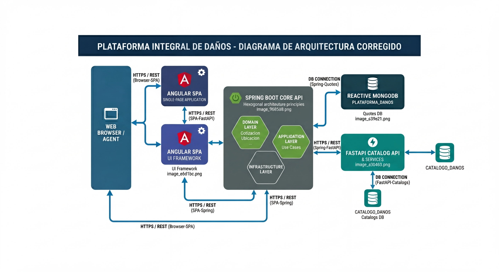

# Cotizador Integral de Danos

Autor: Hansel Bonifacio Trujillo  
Rol: Arquitecto de Software / Desarrollador Fullstack

## Vision General del Proyecto

Implementacion de una solucion de software de extremo a extremo para la gestion de seguros de danos.

- Objetivo: Automatizar el flujo de cotizacion, calculo de primas y validacion de riesgos.
- Alcance: Desde la generacion de folios hasta la descarga de certificados PDF.
- Diferenciador: Arquitectura reactiva y manejo de concurrencia optimista.

## Arquitectura General de la Solucion

El diseno del sistema esta orientado al desacoplamiento, la escalabilidad y la resiliencia operativa.

### Componentes principales

- Frontend: Angular con Angular Material y formularios reactivos.
- Backend Core: Java Spring Boot con enfoque de arquitectura hexagonal.
- API Externa: FastAPI para catalogos y tarifas.
- Persistencia: MongoDB para folios, cotizaciones y catalogos.

### Diagrama de arquitectura

La siguiente imagen resume la arquitectura general del sistema:

## Flujo de alto nivel

1. El usuario interactua con la SPA en Angular.
2. La aplicacion web invoca el backend principal en Spring Boot.
3. El backend procesa reglas de negocio y persiste informacion en MongoDB.
4. Para datos maestros y tarifas, el backend consulta servicios FastAPI.
5. El resultado se devuelve al frontend para continuar con la cotizacion.

## Casos de Uso del Sistema

- UC01 - Inicializacion: Creacion de folio unico e idempotente.
- UC02 - Gestion de ubicaciones: Registro dinamico de bienes inmuebles.
- UC03 - Configuracion de layout: Personalizacion de interfaz segun el riesgo.
- UC04 - Motor de calculo: Ejecucion de calculos financieros con datos parciales validos.

## Reglas de Negocio Criticas

- Versionado optimista: Uso del campo version para evitar sobreescrituras.
- Persistencia de agregado: La cotizacion se guarda como documento principal integro.
- Validacion de calculo: Solo se calculan ubicaciones con codigo postal y giro validos.

## Aseguramiento de Calidad

Se utiliza Serenity BDD con el patron Screenplay para pruebas funcionales de extremo a extremo.

- Escenario E2E principal: El actor Agente ejecuta el flujo completo de cotizacion.
- Enfoque: Pruebas centradas en comportamiento y valor funcional.
- Entregable: Reportes vivos para evidencia funcional y trazabilidad.